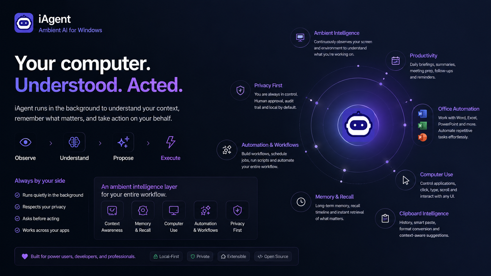
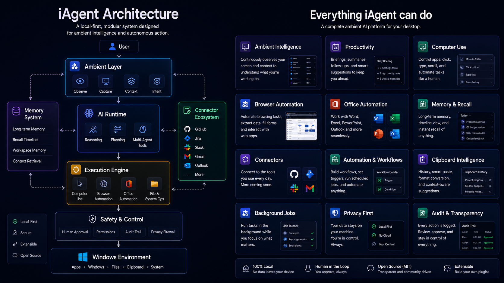

# iAgent Windows

Desktop-native AI agent runtime for Windows with local execution, tool orchestration, safety approvals, and persistent personal workflows.



## What This Repo Actually Ships Today

`iagent-windows` is a Rust workspace plus a Python desktop dock.

- Rust runtime (`iagent` binary) for agent orchestration, providers, tools, sessions, memory, and safety
- Python desktop dock (`app/iagent-py`) for tray/dock UX, proposal popups, settings, and Office-goal routing
- Windows install/runtime scripts (`scripts/install.ps1`, launcher/hotkey/personal-daemon setup)

## Architecture and Functionalities



## Core Functional Surface

### 1. Runtime + Agent Orchestration

- Local async agent runtime with session management and background daemon mode
- Tool-call execution loop with structured tool schemas
- Subagent orchestration (`subagent` / `task` tool family, `swarm`/communicate support)
- MCP server management (`mcp` tool)

### 2. Safety / Approval / Audit

- Permission gating for mutating desktop actions (click/type/hotkey/scroll)
- Action history + flight recorder (`flight_recorder` tool)
- Connector write preflight + explicit scope grants + write evidence ledger (`connector` tool)

### 3. Personal Desktop Layer

Implemented via `personal` tool + `personal-daemon`:

- snippets + typed expansion
- reminders + due/snooze flows
- clipboard capture/recovery/pin/delete
- recent app/window recall + switch helpers
- background jobs and job queue controls
- timeline capture/search/delete
- window snapping/tiling/layout plans + project workspaces
- privacy/sensitive-context controls and personal-data clearing

### 4. Productivity / Workflow Systems

- `briefing`: proactive briefings, recaps, next-best suggestions
- `attention`: quiet hours, interruption budgets, delivery/digest control
- `dispatch`: authenticated local/remote task dispatch, approval, completion/failure evidence
- `meeting`: transcript/action-item capture and conversion flows
- `recipe`: reusable typed workflow plans
- `processing_report`: processing/transparency records and export
- `intent`: discover/validate/import/list app intent manifests (`iagent.intent.json`)

### 5. Desktop, Browser, and Office Integrations

- `computer` tool: screenshot, active window/context, list/open apps, click/type/hotkey/scroll/wait
- `browser` tool: browser bridge control (status/setup/tabs/open/snapshot/content/interactables/click/type/fill/eval/etc.)
- `app` tool:
  - OfficeCLI operations (`oc_*`) for `.docx`, `.xlsx`, `.pptx`
  - browser/form automation actions (`browser_*`, `form_fill`)
- Word-focused helper tool (`word`) plus deterministic Office scripts under `app/iagent-py`

### 6. Built-In Tooling (first-party)

The runtime currently registers tools including:

`read`, `write`, `edit`, `multiedit`, `patch`, `apply_patch`, `glob`, `grep`, `ls`, `file`, `bash`, `open`, `agentgrep`, `codesearch`, `browser`, `computer`, `websearch`, `webfetch`, `memory`, `conversation_search`, `session_search`, `goal`, `todo`, `bg`, `batch`, `dispatch`, `connector`, `attention`, `briefing`, `meeting`, `recipe`, `intent`, `processing_report`, `personal`, `flight_recorder`, `swarm`, `gmail`, `word`, `mcp`, `skill_manage`, `skill_script`, `app`, plus self-dev/ambient tools by mode.

## Install (Windows)

```powershell
irm "https://raw.githubusercontent.com/benclawbot/iAgent-windows/main/scripts/install.ps1?v=dock" | iex
```

Installer behavior includes:

- installs `iagent.exe`
- sets up dock runtime (unless `-SkipDockSetup`)
- creates launchers/shortcuts
- can set up Alt+; hotkey startup helper
- can set up personal daemon startup helper
- installs/validates OfficeCLI support

Useful installer switches:

- `-SkipDockSetup`
- `-SkipHotkeySetup`
- `-SkipPersonalDaemonSetup`
- `-SkipDesktopShortcut`
- `-SkipAlacrittySetup`

## CLI Surface (Current)

Top-level commands include:

- `serve`, `connect`, `run`, `repl`, `update`
- `login`, `auth`, `auth-test`
- `provider`, `model`, `usage`, `version`
- `memory`, `session`, `ambient`
- `personal-daemon`
- `pair`, `dictate`
- `setup-hotkey`, `setup-launcher`
- `browser`
- `selfdev`, `debug`
- `restart`

## Provider/Auth Reality

The runtime supports multiple auth/provider paths (OpenAI, OpenRouter, Gemini, Azure/OpenAI-compatible and others via provider profiles).

- primary auth entry: `iagent login`
- diagnostics: `iagent auth status`, `iagent auth doctor`, `iagent auth-test`

(Several internal docs/messages still use older `jcode` naming while runtime behavior is already under `iagent`.)

## Development

```powershell
cargo check --workspace --all-targets
cargo build --bins
cargo test
```

CI currently emphasizes:

- Windows MSVC `cargo check` in multiple feature combos
- focused unit canary test
- build-all-binaries self-check job
- app-integrations office workflow tests
- coverage via `cargo llvm-cov`

## Repository Layout

- `src/` -> runtime, server, agent loop, tool implementations
- `crates/` -> workspace crates (runtime types, providers, integrations, storage, monitor, overlay, etc.)
- `app/iagent-py/` -> Python desktop dock and companion UX
- `scripts/` -> installer, PowerShell checks, dev helpers
- `docs/` -> product/design notes

## Known Gaps / Caveats (Important)

- `lsp` tool is explicitly stubbed (not full LSP integration yet).
- Some help strings/docs still reference legacy `jcode` command naming.
- Current README in `main` documents a `--self-check` CLI path that is not present in the current command parser.
- Browser control exists in more than one path (`browser` tool bridge + `app` tool CDP actions); docs should keep these pathways explicit.

## Suggested Companion Docs

- `OAUTH.md` for provider login/auth details
- `TELEMETRY.md` for telemetry/privacy behavior
- `CONTRIBUTING.md` for contribution workflow


