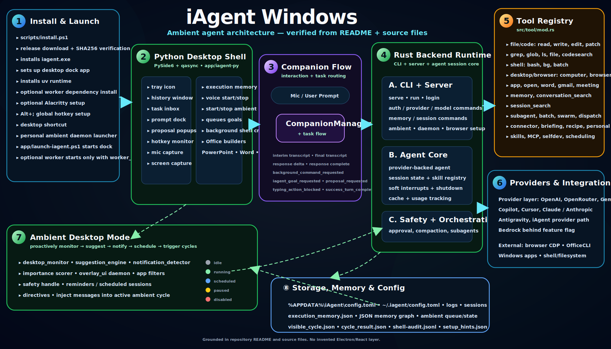

# iAgent Windows

**iAgent Windows** is a desktop-native ambient AI agent for Windows. It combines a Python/PySide6 desktop dock with a Rust agent runtime so the assistant can listen, observe screen context, queue work, run safe local tools, manage background tasks, and optionally keep a personal ambient daemon alive between sessions.

The project is not just a chat box. From the code, it is structured as a local agent platform with a Windows installer, tray/dock UI, voice capture, screen capture, task inbox, proposal popups, execution memory, a Rust CLI/server runtime, a large first-party tool registry, provider routing, persistent memory, and ambient desktop mode.

## What it does

- Provides a **Windows tray/dock assistant** backed by `app/iagent-py`.
- Supports **voice-first interaction** through mic capture, transcription, LLM response streaming, and TTS paths.
- Captures **screen context** through the Python shell and desktop-monitor crates.
- Queues **agent goals** into the Rust backend with `iagent run --json --quiet <goal>`.
- Runs **background commands** while tracking task start/running/finished/failed states.
- Shows **proposal popups** so potentially mutating actions can be approved or rejected.
- Supports **ambient mode**: desktop monitoring, suggestion generation, notification detection, reminders, directives, scheduled queues, and injected messages into active cycles.
- Includes a large **tool registry** for files, code editing, shell execution, browser/desktop actions, Gmail, Word/Office workflows, memory, session search, subagents, batch execution, swarm communication, skills, MCP, scheduling, and self-development.
- Uses persistent **config, logs, sessions, execution memory, ambient state, and JSON memory graphs**.

## Verified Architecture

The diagram below is stored in the repository under `assets/diagrams/` and embedded with standard GitHub README HTML.

<p align="center">
  
</p>

## Main components

| Layer | What exists in the repo | Key files |
| --- | --- | --- |
| Install and launch | PowerShell installer, release download, SHA256 verification, binary install, `uv` setup, dock setup, hotkey listener, desktop shortcut, personal daemon launcher | `scripts/install.ps1`, `app/launch-iagent.ps1` |
| Python desktop shell | PySide6 tray app, history window, task inbox, prompt dock, proposal popups, hotkey monitor, mic capture, screen capture, background command runner, execution memory | `app/iagent-py/iagent/app.py`, `app/iagent-py/pyproject.toml` |
| Companion flow | Mic/text prompt flow, transcription, LLM response handling, task routing, proposal handling, assistant feedback | `app/iagent-py/iagent/app.py`, `app/iagent-py/iagent/companion_manager.py` |
| Rust backend runtime | CLI startup, server mode, one-shot runs, login/auth, provider/model commands, memory/session commands, ambient commands, browser setup, restart/update handling | `src/main.rs`, `src/cli/startup.rs`, `src/cli/args.rs`, `src/cli/dispatch.rs`, `src/server.rs` |
| Agent core | Provider-backed agent sessions, skills, session state, active-tool restrictions, soft interrupts, background-tool signal, graceful shutdown, cache tracking, usage tracking | `src/agent.rs` |
| Tool registry | File/code tools, shell tools, browser/computer/app tools, Word/Gmail/meeting tools, memory/search tools, subagent/batch/swarm orchestration, skills, MCP, selfdev, scheduling | `src/tool/mod.rs`, `crates/iagent-tool-core`, `crates/iagent-tool-types` |
| Providers | Multi-provider runtime with OpenAI, OpenRouter, Gemini, Copilot, Cursor, Claude/Anthropic, Antigravity, iAgent provider path, and feature-gated Bedrock | `src/provider/mod.rs`, `crates/iagent-provider-*` |
| Ambient desktop mode | Desktop monitor, suggestion engine, notification detector, importance scorer, overlay daemon, app filters, safety handle, reminders, scheduled sessions, directives | `src/desktop_ambient.rs`, `src/ambient.rs`, `src/ambient/runner.rs`, `crates/desktop-monitor`, `crates/suggestion-engine`, `crates/overlay-ui` |
| Storage and memory | Windows config, cross-platform config, logs, sessions, execution memory, JSON memory graph files, ambient queue/state, visible cycle context, cycle result, shell audit | `docs/configuration.md`, `docs/memory.md`, `src/storage.rs`, `crates/iagent-storage` |

## Installation

### Windows one-line install

```powershell
irm "https://raw.githubusercontent.com/benclawbot/iAgent-windows/main/scripts/install.ps1?v=0.13.0" | iex
```

The installer is designed to:

1. detect the supported Windows architecture,
2. fetch the latest release or use a local artifact if provided,
3. download `iagent.exe` or the release archive,
4. verify SHA256 checksums for release downloads,
5. install the stable binary into `%LOCALAPPDATA%\iAgent\bin`,
6. install the dock app into `%LOCALAPPDATA%\iAgent\app` unless skipped,
7. install `uv` if missing for the Python dock runtime,
8. install dock dependencies with `uv sync`,
9. optionally install worker dependencies with `npm install`,
10. configure the Alt+; global hotkey launcher,
11. configure the personal ambient daemon launcher,
12. create a desktop shortcut for the dock.

### Installer switches

```powershell
-SkipDockSetup
-SkipHotkeySetup
-SkipPersonalDaemonSetup
-SkipDesktopShortcut
-SkipAlacrittySetup
```

### Local artifact install

The installer also supports local artifacts through parameters such as `-ArtifactExePath`, `-ArtifactTgzPath`, and `-Version`, which is useful for testing a build before publishing a release.

### Uninstall

```powershell
powershell -ExecutionPolicy Bypass -File .\scripts\uninstall.ps1
```

## Runtime flow

1. `scripts/install.ps1` installs the Rust backend binary and the Python dock application.
2. `app/launch-iagent.ps1` starts the Python dock with `uv run python -m iagent`.
3. If `worker_url` is configured, the launcher can also start the optional worker runtime.
4. The Python app starts the tray icon, history window, task inbox, prompt dock, hotkey monitor, mic capture, and screen capture.
5. The companion layer turns voice/text/screen context into assistant responses, background commands, proposals, or iAgent goals.
6. Agent goals are queued into the Rust runtime using `iagent run --json --quiet <goal>`.
7. The Rust runtime initializes providers, sessions, tools, skills, memory, safety controls, and execution orchestration.
8. Ambient mode can run separately through `iagent ambient desktop --headless` or through the configured personal daemon.

## Ambient agent behavior

Ambient mode is visible in the source as a first-class runtime path rather than a README-only concept. It includes:

- `AmbientStatus`: idle, running, scheduled, paused, disabled.
- `ScheduledItem`: scheduled work with priority, target, source session, working directory, relevant files, branch, and additional context.
- `ScheduleTarget`: ambient wakeup, delivery back into a session, or spawning a derived session.
- `AmbientCycleResult`: summary, modified memories count, compactions, proactive work, next schedule, timestamps, status, and optional conversation transcript.
- `VisibleCycleContext`: persisted visible-cycle context under the iAgent ambient directory.
- `AmbientRunnerHandle`: state, queue preview, wake notifications, active sessions, active cycle interrupt queue, safety system, and notification dispatcher.
- Desktop monitoring through `desktop_monitor`, suggestions through `suggestion_engine`, and overlays through `overlay_ui`.

In practical terms, this means the app can monitor desktop context, detect potentially important notifications, generate writing/task suggestions, queue reminders, trigger cycles, receive external messages into an active ambient cycle, and keep a personal daemon running in the background.

## Tools and capabilities

The runtime registers many first-party tools. The important categories are:

- **File and code:** `read`, `write`, `edit`, `multiedit`, `patch`, `apply_patch`, `ls`, `glob`, `grep`, `file`, `codesearch`, `lsp`.
- **Execution:** `bash`, `batch`, `bg`.
- **Desktop/browser/app:** `computer`, `browser`, `app`, `open`, `word`.
- **Workflow/integrations:** `gmail`, `meeting`, `briefing`, `connector`, `recipe`, `processing_report`, `attention`, `personal`.
- **Memory/search:** `memory`, `conversation_search`, `session_search`.
- **Orchestration:** `goal`, `todo`, `subagent`, `dispatch`, `swarm`, `communicate` alias handling, `skill_manage`, `skill_script`, `mcp`.
- **Ambient/self-development:** `schedule`, `selfdev`, `flight_recorder`, `intent`, `invalid` fallback handling.

Tool execution includes routing through a goal judge, telemetry recording, and context overflow guarding so large tool outputs do not dominate the model context.

## Providers

The Rust provider layer includes a multi-provider runtime with support paths for:

- OpenAI
- OpenRouter
- Gemini
- Copilot
- Cursor
- Claude / Anthropic
- Antigravity
- iAgent provider path
- AWS Bedrock behind the `bedrock` feature flag

The docs identify OpenAI, OpenRouter, and Gemini as shipped/supported provider paths for v1.0, with Bedrock as optional/feature-gated.

## Configuration

The canonical runtime configuration is `config.toml`.

Known paths from the docs and launcher code:

- Windows launcher/runtime: `%APPDATA%\iAgent\config.toml`
- Cross-platform/default runtime: `~/.iagent/config.toml`

Core sections include:

```toml
[provider]
default_provider = "openai"
openai_reasoning_effort = "low"

[features]
memory = true
swarm = true
update_channel = "stable"

[permissions]
shell_execution = "proposal"
file_write_paths = ["~", "%USERPROFILE%\\Projects"]
network_access = true
elevation_allowed = false
```

## Trust and safety

Mutating actions are designed to be explicit and auditable.

Actions that can change local state are expected to go through approval controls, including:

- shell execution,
- file writes/deletes,
- desktop/browser form submission,
- Office document mutations.

When a proposal is shown:

- **Reject** cancels the action and logs the decision.
- **Approve** executes the action and logs it with a timestamp.
- Pending proposals are not auto-executed after a crash/restart.

Power users can run unattended mode with:

```powershell
iagent --auto-approve
```

Use unattended mode only in trusted environments.

Shell execution audit entries are appended to `shell-audit.jsonl` under the iAgent logs directory.

## Browser automation

Browser control uses Chrome/Edge DevTools Protocol (CDP). If no debuggable browser is available, launch Chrome or Edge with a remote debugging port, for example:

```powershell
chrome --remote-debugging-port=9222
msedge --remote-debugging-port=9223
```

See `docs/browser-smoke.md` for the ignored smoke-test suite that requires live browsers.

## Memory and persistence

Memory durability is documented as JSON graph storage under the iAgent data directory:

- project-scoped memory: `memory/projects/<project-hash>.json`
- global memory: `memory/global.json`
- backup sidecars: `*.bak`

The memory contract includes atomic temp-file replacement, backup recovery for corrupted primary JSON, export commands, clear commands, schema versioning, and legacy migration behavior.

Useful commands:

```powershell
iagent memory export --output <file> --scope all|project|global
iagent memory clear --scope all|project|global
```

`memory clear` requires explicit confirmation unless `--force` is supplied.

## Development

```powershell
cargo check --workspace --all-targets
cargo test --workspace --tests
cargo clippy --workspace --all-targets -- -D warnings
```

Default builds are headless. TUI compatibility checks are feature-gated:

```powershell
cargo build
cargo build --features tui
```

The Rust TUI is not the primary end-user interface; the Python dock app is the user-facing shell.

## Antivirus-friendly build boundary

iAgent keeps desktop automation capabilities available in runtime builds, but default Windows test runs avoid Cargo's monolithic library unit-test executable. That harness can look ransomware-like to behavior engines because one constantly changing unsigned process rapidly exercises memory, file, network, provider, desktop, and background-job code. Maintainers can still run the full library unit sweep explicitly with `cargo test --lib` in a trusted build environment.

Library-test builds also use non-executing desktop stubs, a repo-local temp directory, and stripped symbols to reduce false-positive surface. Windows builds embed iAgent version metadata and an `asInvoker` application manifest. Release artifacts should still be code-signed by the distribution pipeline; unsigned local debug and test binaries can trigger reputation or behavior-based antivirus heuristics.

## Documentation

- Config reference: `docs/configuration.md`
- Tool/provider matrix: `docs/tools.md`
- Skills authoring/discovery: `docs/skills.md`
- Memory durability/export/clear: `docs/memory.md`
- Product naming conventions: `docs/product-naming.md`
- OAuth/auth notes: `OAUTH.md`
- Telemetry/privacy: `TELEMETRY.md`
- Browser smoke tests: `docs/browser-smoke.md`

## Contributing

Contribution workflow is documented in `CONTRIBUTING.md`.

## License

This project is licensed under the **MIT License**. See `LICENSE`.

## Suggested GitHub topics

- `windows`
- `ai-agent`
- `desktop-agent`
- `ambient-computing`
- `rust`
- `python`
- `llm`
- `automation`
