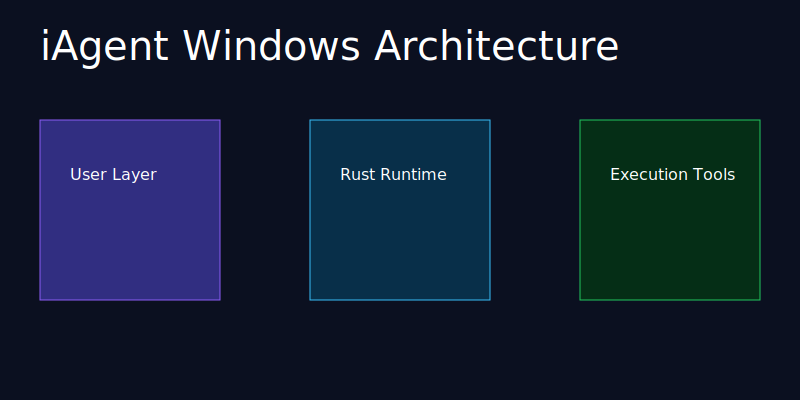

# iAgent Windows

Ambient AI runtime for Windows.

## Architecture



## Features

- Rust runtime
- Desktop dock
- Local execution
- Provider integrations
- Persistent sessions
- Tool execution
- Background workflows

## Runtime

The platform includes:

- session management
- memory systems
- provider routing
- shell execution
- filesystem tooling
- ambient jobs

## Install

```powershell
irm "https://raw.githubusercontent.com/benclawbot/iAgent-windows/main/scripts/install.ps1?v=dock" | iex
```

## Build

```bash
cargo build
```
