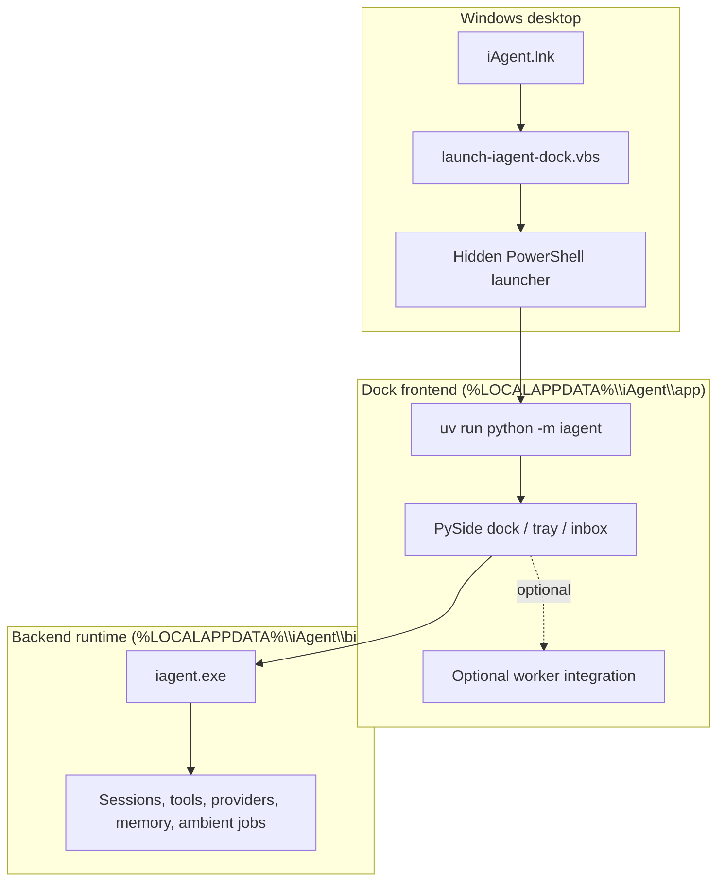

# iAgent Windows

iAgent is a Windows robot dock for local agent work.

It gives you a desktop companion that stays available for follow-up while the
backend runs locally and handles files, apps, shell commands, and web context.

## What It Can Do

- Open from a desktop robot icon into a dock/tray UI with no terminal window.
- Accept typed or spoken tasks and queue them for local execution.
- Operate on Windows desktop workflows, local files, and shell commands.
- Run background jobs while keeping the dock available for follow-up.
- Work with provider-backed model calls and persistent session context.
- Start the optional worker integration when configured.
- Keep the backend CLI available for terminal users who want direct access.

## Prerequisites

- Windows 10 or Windows 11
- PowerShell 5.1 or newer
- Internet access for installation and provider auth
- An account or API access for at least one supported model provider

Optional:

- Node.js/npm if you enable the worker integration with `worker_url`

## Install

Run this in PowerShell:

```powershell
irm "https://raw.githubusercontent.com/benclawbot/iAgent-windows/main/scripts/install.ps1?v=dock" | iex
```

The installer:

- downloads the current backend release
- installs the desktop dock frontend
- installs Python dependencies with `uv`
- creates the `iAgent` desktop shortcut with the robot icon
- configures `Alt+;` for quick launch
- adds the backend CLI directory to your user `PATH`

Installed layout:

- `%LOCALAPPDATA%\iAgent\bin`: backend CLI and hidden dock launcher scripts
- `%LOCALAPPDATA%\iAgent\app`: desktop dock frontend, tray runtime, and worker integration
- `%LOCALAPPDATA%\iAgent\logs`: dock launcher diagnostics

## Screenshot


## First Start

1. Double-click the `iAgent` robot icon on your desktop.
2. The dock opens without leaving a terminal window on screen.
3. Type or speak a task, for example:
   - "Open Notepad and draft a short follow-up."
   - "Summarize what changed in this folder today."
   - "Run the tests here and tell me what failed."
   - "Create a release note from recent commits."
4. Add provider credentials when prompted or through the app config.

If you prefer the terminal, the backend CLI is still available:

```powershell
iagent
```

After installation, `Alt+;` also opens the dock.

## Architecture

The installed product is split into a frontend dock and a backend engine.



How the flow works:

1. The desktop shortcut launches a hidden script, not a visible terminal.
2. The hidden launcher points the dock at the installed backend executable.
3. The frontend starts `uv run python -m iagent` from the dock app.
4. The dock handles the UI surfaces and queues work into the backend.
5. The backend executes the work and streams results back to the app.

## Current Components

- `scripts/install.ps1`: one-command Windows installer and launcher setup
- `scripts/check_powershell_syntax.ps1`: syntax check for installer scripts
- `src/main.rs`: backend entry point
- `src/cli/*`: backend CLI startup and provider/auth setup
- `src/server/*`: local runtime server, sessions, diagnostics, background work
- `src/agent/*`: turn execution, prompting, tool dispatch, response recovery
- `src/tool/*`: filesystem, shell, browser/web, planning, memory, integration tools
- `src/provider/*`: model/provider routing
- `src/auth/*`: login and token refresh flows
- `src/ambient/*`: ambient/background workflows

## Notes

- The installer is meant to be the normal path for desktop use.
- The backend CLI remains useful for direct terminal workflows.
- The dock frontend is installed separately because it owns the Windows UI.
