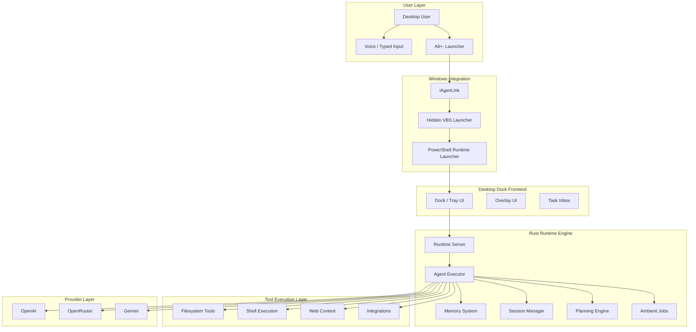

# 🤖 iAgent Windows

<div align="center">

### Autonomous AI Agent Runtime for Windows

Persistent desktop AI orchestration with local execution, ambient workflows, provider routing, memory systems, and tool-driven automation.


</div>

---

## Screenshots


---

# Overview

iAgent Windows is a local-first ambient AI runtime designed for persistent desktop workflows.

Unlike browser-only assistants or stateless chatbot wrappers, iAgent behaves like a continuously available execution environment capable of:

- interacting with the local machine
- orchestrating desktop workflows
- executing shell commands
- operating on files and projects
- maintaining persistent sessions and memory
- running background and ambient jobs
- coordinating provider-backed reasoning
- integrating directly into Windows UX

The platform combines:

- a modular Rust async runtime
- desktop dock and overlay interfaces
- provider abstraction layers
- persistent memory and storage systems
- execution planning pipelines
- tooling orchestration
- local-first execution
- ambient automation

---

# Core Capabilities

## Autonomous Execution

The runtime is designed around execution-first agent behavior.

Agents can:

- plan actions
- dispatch tools
- operate on projects
- execute commands
- iterate on tasks
- maintain contextual continuity

---

## Persistent Memory

Dedicated memory and storage layers enable:

- persistent sessions
- contextual continuity
- structured knowledge
- long-running workflows
- memory-aware orchestration

---

## Tool Ecosystem

Integrated tooling includes:

- filesystem access
- shell execution
- web context tooling
- planning systems
- integration layers
- memory tooling
- desktop automation

---

## Multi-Provider Runtime

Provider abstraction enables routing across:

- OpenAI
- OpenRouter
- Gemini
- AWS Bedrock-related infrastructure

---

# Architecture



---

# Runtime Philosophy

The runtime is designed around several architectural principles:

## Local-first execution

The backend executes locally on the user's machine.

Benefits include:

- direct filesystem access
- shell execution
- lower latency
- desktop integration
- local orchestration
- privacy-preserving workflows

## Ambient computing model

Instead of isolated chat sessions, iAgent behaves more like:

- an ambient assistant
- a desktop copilot
- a workflow runtime
- an orchestration layer

## Tool-centric design

The LLM is not the system.

The runtime itself is the system.

The architecture prioritizes:

- execution pipelines
- orchestration
- runtime coordination
- planning systems
- tools
- memory
- workflows

---

# Repository Structure

## Runtime

- `src/main.rs` → backend entry point
- `src/agent/*` → execution orchestration
- `src/server/*` → local runtime server
- `src/tool/*` → tool execution layer
- `src/provider/*` → provider routing
- `src/auth/*` → auth and token handling
- `src/ambient/*` → background workflows

---

# Workspace Crates

| Crate | Purpose |
|---|---|
| `jcode-agent-runtime` | Runtime orchestration |
| `jcode-memory-types` | Memory structures |
| `jcode-storage` | Persistence layer |
| `jcode-plan` | Planning engine |
| `jcode-provider-openai` | OpenAI integration |
| `jcode-provider-openrouter` | OpenRouter integration |
| `jcode-provider-gemini` | Gemini integration |
| `jcode-desktop` | Desktop integration |
| `overlay-ui` | Overlay runtime |
| `desktop-monitor` | Desktop monitoring |
| `suggestion-engine` | Suggestion systems |

---

# Installation

## One-Command Install

```powershell
irm "https://raw.githubusercontent.com/benclawbot/iAgent-windows/main/scripts/install.ps1?v=dock" | iex
```

---

# Installed Layout

```text
%LOCALAPPDATA%\\iAgent
├── bin/
├── app/
└── logs/
```

---

# Development

## Build

```bash
cargo build
```

## Release Build

```bash
cargo build --profile release-lto
```

## Run

```bash
cargo run --bin iagent
```

---

# Long-Term Direction

The architecture is moving toward:

- ambient AI systems
- persistent orchestration
- long-running workflows
- memory-aware agents
- execution-first runtimes
- desktop-native AI environments
- autonomous workflow coordination

This repository is structured more like an operating layer for AI workflows than a traditional chatbot frontend.

---

# Contributing

Areas especially valuable for contribution:

- provider integrations
- tool development
- orchestration systems
- memory systems
- desktop automation
- Windows UX
- runtime reliability
- ambient workflow systems

---

# License

See repository license for details.

---

<div align="center">

### Build agents that don't just chat — but execute, orchestrate, remember, and evolve.

</div>