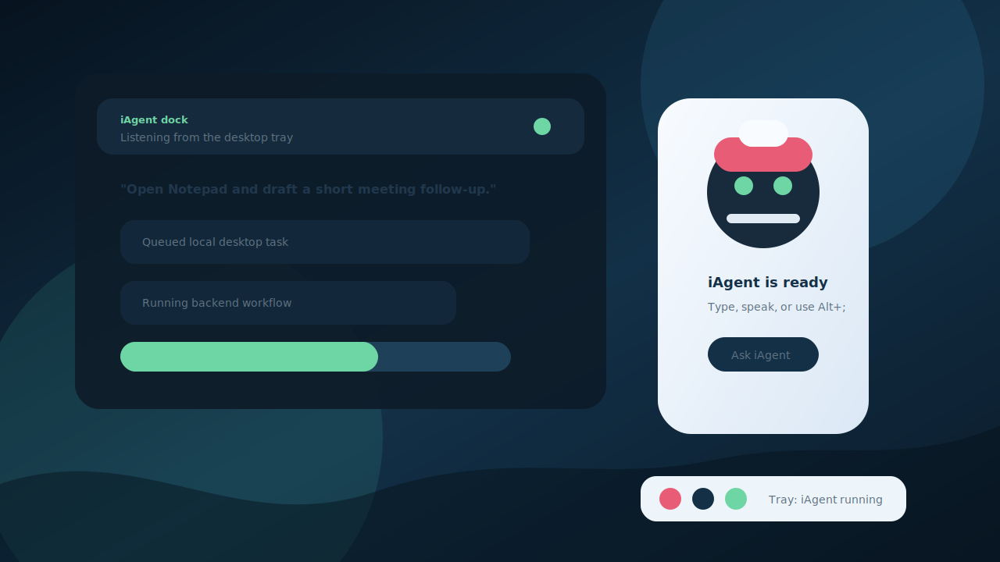

# iAgent Windows

iAgent is a robot dock for Windows: a small desktop companion that stays close
to your workspace, accepts natural-language tasks, and hands them to a local
agent runtime that can operate across your files, apps, commands, and web
context.

Use it when you want the computer to do the work with you: open or control
desktop apps, run background workflows, draft content, inspect local projects,
execute shell commands, remember context, and report progress back through the
dock/tray experience.



## What It Can Do

- Launch from a robot desktop icon into a dock/tray UI, without leaving a
  terminal window open.
- Accept desktop tasks in natural language and route them to the local agent
  backend for execution.
- Run Windows commands and background workflows while the dock remains
  available for follow-up.
- Work with local folders, project files, search, shell tools, memory, planning,
  and provider-backed model calls.
- Start optional worker/web integrations when configured.
- Use `Alt+;` as a global shortcut to bring up the dock after installation.
- Keep the backend CLI available as `iagent` for users who also want terminal
  access.

## Prerequisites

- Windows 10 or Windows 11
- PowerShell 5.1 or newer
- Internet access for installation, dependency setup, and provider auth
- An account/API access for at least one supported model provider

Optional but recommended:

- Node.js/npm if you plan to use the optional worker integration.
- `winget` for installing optional Windows tooling outside the core dock flow.

## Install (One Command)

Run in PowerShell:

```powershell
irm https://raw.githubusercontent.com/benclawbot/iagent-windows/main/scripts/install.ps1 | iex
```

The installer downloads the latest backend release, installs the desktop dock
frontend, installs Python runtime dependencies with `uv`, creates a desktop
shortcut with the iAgent robot icon, configures `Alt+;`, and adds the backend
CLI directory to your user `PATH`.

Installed layout:

- `%LOCALAPPDATA%\iAgent\bin`: backend CLI plus hidden dock launcher scripts.
- `%LOCALAPPDATA%\iAgent\app`: desktop dock frontend, tray runtime, and worker
  integration files.
- `%LOCALAPPDATA%\iAgent\logs`: dock launcher diagnostics.

## First Start

1. Double-click the `iAgent` robot icon on your desktop.
2. The dock/tray app starts in the background with no terminal window.
3. Use the dock to type or speak a concrete task, for example:
   - "Open Notepad and draft a short meeting follow-up."
   - "Summarize what changed in this project folder today."
   - "Run the tests here and tell me what failed."
   - "Create a quick release note from recent commits."
4. Configure provider credentials when prompted or through the app config.

Terminal users can still run the backend directly:

```powershell
iagent
```

Use `Alt+;` after installation to launch the dock again quickly.


## Architecture (Current)

iAgent Windows is the installer and backend runtime distribution. The installed
desktop product has two layers:

- Desktop dock frontend: downloaded during installation into
  `%LOCALAPPDATA%\iAgent\app`; it owns the PySide dock, tray icon, voice/task
  loop, task inbox, and optional worker integration.
- Windows backend engine: this repository's Rust workspace builds `iagent.exe`,
  which handles provider routing, tool execution, sessions, memory, ambient
  background work, and local command workflows.

High-level flow:

1. The desktop shortcut runs `%LOCALAPPDATA%\iAgent\bin\launch-iagent-dock.vbs`.
2. The hidden launcher starts PowerShell without a visible terminal and points
   the dock compatibility layer at the installed backend executable.
3. The frontend launcher starts `uv run python -m iagent` from the dock app.
4. The dock/tray UI receives user tasks and queues local backend workflows.
5. The Rust backend runs the work and streams progress/results through the app
   surfaces and logs.
### Runtime Entry Points

Defined in `Cargo.toml`:

- `iagent` -> `src/main.rs`
- `iagent-ambient` -> `src/bin/ambient.rs`
- `iagent-overlay-ui` -> `src/bin/overlay_ui.rs`
- `iagent-test-api` -> `src/bin/test_api.rs`
- `iagent-harness` -> `src/bin/harness.rs`

### Core Subsystems

- `src/cli/*`: command parsing, startup orchestration, terminal launch, login,
  and provider initialization flows.
- `src/server/*`: local runtime server, client/session lifecycle, reload,
  background tasks, state management, and diagnostics.
- `src/agent/*`: turn execution loop, prompting, streaming, tool dispatch, and
  response recovery.
- `src/tool/*`: tool registry and tool implementations (filesystem, shell,
  browser/web, planning/todo, memory, and integrations).
- `src/provider/*` + `src/provider_catalog*`: model/provider routing and
  provider-specific behavior.
- `src/auth/*`: auth state, login flows, token refresh, and provider auth
  integrations.
- `src/ambient/*`, `src/ambient_runner.rs`, `src/ambient_scheduler.rs`:
  ambient state, scheduling, directives, and persistence.
- `src/memory*`: memory graph, logs, caches, and memory-agent coordination.
- `src/mcp/*`: MCP client/manager and shared MCP pool integration.
- `src/transport/*` + `src/protocol*`: local transport/protocol plumbing.

## Build Profiles and Features

Current feature setup in `Cargo.toml`:

- Default feature set: `pdf`
- Optional: `terminal-ui`
- Optional: `embeddings`
- Optional allocator tuning: `jemalloc`, `jemalloc-prof`

`src/main.rs` includes allocator/runtime tuning for long-running workloads.

## CI (Current)

Workflow: `.github/workflows/windows-backend.yml`

Windows CI runs:

1. `./scripts/check_powershell_syntax.ps1`
2. `cargo check --workspace --all-targets` (default features)
3. `cargo check --workspace --all-targets --no-default-features --features pdf`
4. `cargo check --workspace --all-targets --features terminal-ui`
