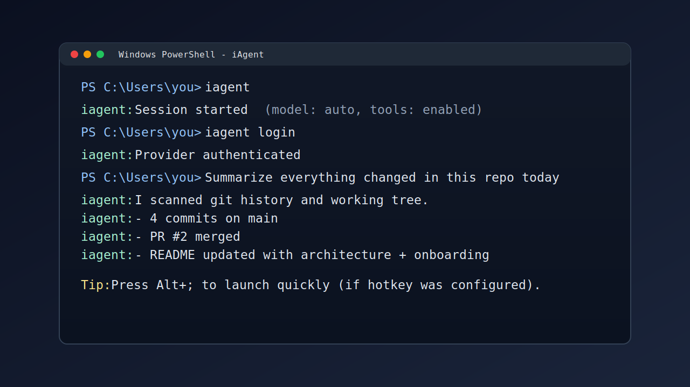

# iAgent Windows

An AI operator for your Windows desktop.

iAgent runs as a local Windows-first runtime that can reason over your tasks,
use tools, and execute work across files, shell commands, web context, and
connected providers.



## What It Can Do

- Run interactive AI sessions from your terminal with streaming responses.
- Execute local tool workflows for files, search, shell, planning/todos, and
  structured automation tasks.
- Connect to multiple providers and route requests based on capability and
  configuration.
- Persist session context and memory so long-running work can be resumed.
- Run ambient/background workflows and lifecycle-managed local server mode.
- Integrate with desktop helpers including optional global hotkey launch
  (Alt+;) through Alacritty setup in the installer.

## Prerequisites

- Windows 10 or Windows 11
- PowerShell 5.1 or newer
- Internet access for installation and provider auth
- An account/API access for at least one supported model provider

Optional but recommended:

- `winget` (used by the installer to set up Alacritty automatically)

## Install (One Command)

Run in PowerShell:

```powershell
irm https://raw.githubusercontent.com/benclawbot/iAgent-windows/main/scripts/install.ps1 | iex
```

The installer downloads the latest release, installs `iagent.exe` to:

`%LOCALAPPDATA%\iAgent\bin`

and adds that location to your user `PATH`.

## First Start (2 Minutes)

1. Open a new terminal window.
2. Start iAgent:

```powershell
iagent
```

3. Authenticate with a provider:

```powershell
iagent login
```

4. Start with a concrete task, for example:
   - "Summarize what changed in this folder today."
   - "Find failing tests and suggest a minimal fix."
   - "Draft a release note from recent commits."

If Alacritty + hotkey setup succeeded during install, you can also launch
iAgent quickly via `Alt+;`.

## Architecture (Current)

The codebase is a Rust workspace with one primary library crate (`iagent`) and
supporting internal crates.

High-level flow:

1. Process startup enters `src/main.rs` and calls `iagent::run()`.
2. CLI startup (`src/cli/startup.rs`) parses mode and loads configuration.
3. The runtime server manages sessions, tools, providers, and background work.
4. Optional ambient and UI binaries run specialized loops on the same core.

### Runtime Entry Points

Defined in `Cargo.toml`:

- `iagent` -> `src/main.rs`
- `iagent-ambient` -> `src/bin/ambient.rs`
- `iagent-overlay-ui` -> `src/bin/overlay_ui.rs`
- `iagent-test-api` -> `src/bin/test_api.rs`
- `iagent-harness` -> `src/bin/harness.rs`

### Core Subsystems

- `src/cli/*`: command parsing, startup orchestration, terminal launch, login,
  and provider initialization flows.
- `src/server/*`: local runtime server, client/session lifecycle, reload,
  background tasks, state management, and diagnostics.
- `src/agent/*`: turn execution loop, prompting, streaming, tool dispatch, and
  response recovery.
- `src/tool/*`: tool registry and tool implementations (filesystem, shell,
  browser/web, planning/todo, memory, and integrations).
- `src/provider/*` + `src/provider_catalog*`: model/provider routing and
  provider-specific behavior.
- `src/auth/*`: auth state, login flows, token refresh, and provider auth
  integrations.
- `src/ambient/*`, `src/ambient_runner.rs`, `src/ambient_scheduler.rs`:
  ambient state, scheduling, directives, and persistence.
- `src/memory*`: memory graph, logs, caches, and memory-agent coordination.
- `src/mcp/*`: MCP client/manager and shared MCP pool integration.
- `src/transport/*` + `src/protocol*`: local transport/protocol plumbing.

## Build Profiles and Features

Current feature setup in `Cargo.toml`:

- Default feature set: `pdf`
- Optional: `terminal-ui`
- Optional: `embeddings`
- Optional allocator tuning: `jemalloc`, `jemalloc-prof`

`src/main.rs` includes allocator/runtime tuning for long-running workloads.

## CI (Current)

Workflow: `.github/workflows/windows-backend.yml`

Windows CI runs:

1. `./scripts/check_powershell_syntax.ps1`
2. `cargo check --workspace --all-targets` (default features)
3. `cargo check --workspace --all-targets --no-default-features --features pdf`
4. `cargo check --workspace --all-targets --features terminal-ui`
