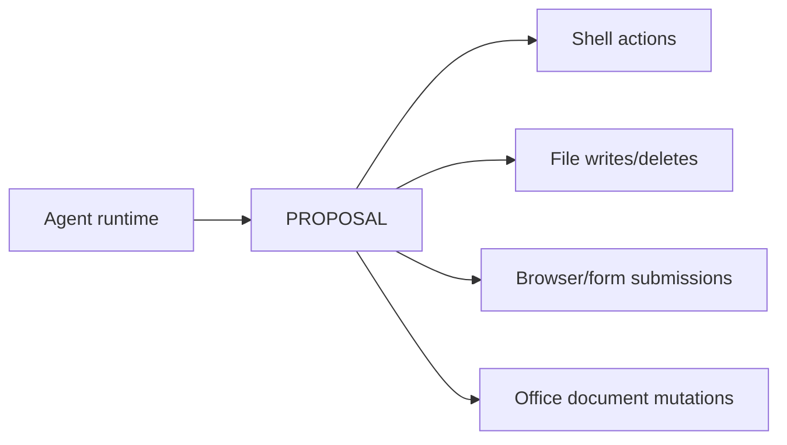

# iAgent Windows

Desktop-native AI agent runtime for Windows with local tool execution, explicit safety controls, and persistent memory.

## Minimum Requirements

- Windows: **Windows 10 22H2+** (Windows 11 recommended)
- RAM: **8 GB minimum** (16 GB recommended for large sessions)
- Disk: **2 GB free** minimum (more for build/test workflows)
- Tooling for source builds:
  - Rust **1.70+** (`rustc --version`)
  - Git (`git --version`)
  - PowerShell **5.1+** (`$PSVersionTable.PSVersion`)

## Install (Windows)

Pinned script URL (recommended):

```powershell
irm "https://raw.githubusercontent.com/benclawbot/iAgent-windows/main/scripts/install.ps1?v=0.13.0" | iex
```

The installer now performs SHA256 verification against release `checksums.txt` before installing downloaded binaries.

Useful switches:

- `-SkipDockSetup`
- `-SkipHotkeySetup`
- `-SkipPersonalDaemonSetup`
- `-SkipDesktopShortcut`
- `-SkipAlacrittySetup`

Uninstall:

```powershell
powershell -ExecutionPolicy Bypass -File .\scripts\uninstall.ps1
```

## Trust & Safety

Mutating actions are designed to be explicit and auditable.



### Proposal flow

Actions that can change local state are expected to go through approval controls, including:

- shell execution
- file writes/deletes
- desktop/browser form submission
- Office document mutations

When a proposal is shown, users can approve or reject.

- **Reject**: action is cancelled and logged.
- **Approve**: action executes and is logged with timestamp.
- On restart after a crash, pending proposals are never auto-executed.

### Auto-approve mode

Power users can run unattended mode with:

```powershell
iagent --auto-approve
```

This bypasses interactive approval prompts for proposal-mode shell actions. Use only in trusted environments.

### Permissions policy (`config.toml`)

`[permissions]` controls shell behavior and scope:

```toml
[permissions]
shell_execution = "proposal"        # proposal | auto | disabled
file_write_paths = ["~", "%USERPROFILE%\\Projects"]
network_access = true
elevation_allowed = false
```

Shell execution audit entries are appended to `shell-audit.jsonl` under the iAgent logs directory.

## Browser Automation Setup

Browser control uses Chrome/Edge DevTools Protocol (CDP).

If no debuggable browser is available, choose one of:

1. launch a managed browser instance with debugging enabled
2. update browser launch configuration to include `--remote-debugging-port=9222`

See `docs/browser-smoke.md` for smoke-test commands.

## Headless Build Boundary

Default builds are headless. TUI compatibility checks are feature-gated.

- Headless default: `cargo build`
- TUI compatibility feature: `cargo build --features tui`

The Rust TUI is not the primary end-user interface; the Python dock app is the user-facing shell.

## Provider Matrix (v1.0)

Shipped and supported:

- OpenAI
- OpenRouter
- Gemini

Optional feature-gated provider path:

- AWS Bedrock (currently enabled in default build profile; targeted for stricter feature-gating in follow-up)

See `docs/tools.md` for details.

## First Run

If no config exists, interactive launch triggers a setup wizard that:

1. prompts for provider choice (OpenAI/OpenRouter/Gemini)
2. prompts for API key
3. writes `config.toml`
4. runs a self-check summary

## Configuration and Docs

- Config reference: `docs/configuration.md`
- Tool/provider matrix: `docs/tools.md`
- Skills authoring/discovery: `docs/skills.md`
- Memory durability/export/clear: `docs/memory.md`
- OAuth/auth notes: `OAUTH.md`
- Telemetry/privacy: `TELEMETRY.md`

## Development

```powershell
cargo check --workspace --all-targets
cargo test
cargo clippy --workspace --all-targets -- -D warnings
```

CI gates include Windows builds, clippy warnings-as-errors, focused tests, and coverage generation.

## Contributing

Contribution workflow is documented in `CONTRIBUTING.md`.

## License

This project is licensed under the **MIT License**. See `LICENSE`.

## Suggested GitHub Topics

- `windows`
- `ai-agent`
- `rust`
- `ambient-computing`
- `llm`
- `automation`
